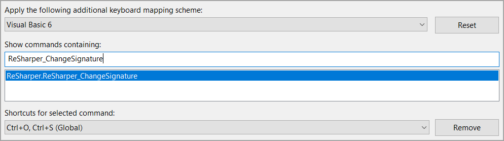
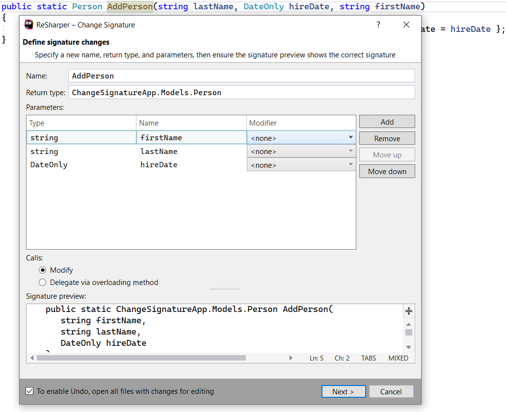

# Change Signature refactoring

This refactoring combines several modifications that can be made to signatures of methods, constructors, properties, and indexers. Along with changing signature in the declaration, ReSharper finds and updates all usages, base symbols, implementations, and overrides of the modified symbol in the current solution.

The default shortcut <kbd>CTRL</kbd> + <kbd>R</kbd>  <kbd>S</kbd> which does not work for me as I don't use the ReSharper keyboard mapping so I use <kbd>CTRL</kbd> + <kbd>O</kbd>  <kbd>S</kbd> be searching for `ReSharper_ChangeSignature` Options, Environment, Keyboard.




Given

```csharp
public static Person AddPerson(string lastName, DateOnly hireDate, string firstName)
{
    return new Person() { Id = 1, FirstName = firstName, LastName = lastName, HireDate = hireDate };
}
```

Used

```csharp
Person person = Operations.AddPerson("Payne", new DateOnly(2022,10,1), "Karen");
```

We want to place firstName as the first parameter. Click on `AddPerson`, use the shortcut key to invoke the dialog, make changes and click Next which changes the signature and the caller arrangement of parameters.




# Out of place code

Included code in Program.Main to show pattern matching

Using `Manager` and `Employee` classes which inherit from a `Person` class provides codes samples for.

- [Pattern Matching](https://docs.microsoft.com/en-us/dotnet/csharp/pattern-matching)
- [is type pattern expression](https://docs.microsoft.com/en-us/dotnet/csharp/pattern-matching#the-is-type-pattern-expression)
- [pattern matching switch statements/expressions](https://docs.microsoft.com/en-us/dotnet/csharp/pattern-matching#using-pattern-matching-switch-statements)
- [Recursive Patterns](https://docs.microsoft.com/en-us/dotnet/csharp/language-reference/proposals/csharp-8.0/patterns) (some are C#8 and others C#9)
- [Microsoft docs switch (C#8)](https://docs.microsoft.com/en-us/dotnet/csharp/language-reference/keywords/switch)

> The pattern matching features in C# provide syntax to express your algorithms. You can use these techniques to implement the behavior in your classes. You can combine object-oriented class design with a data-oriented implementation to provide concise code while modeling real-world objects.


