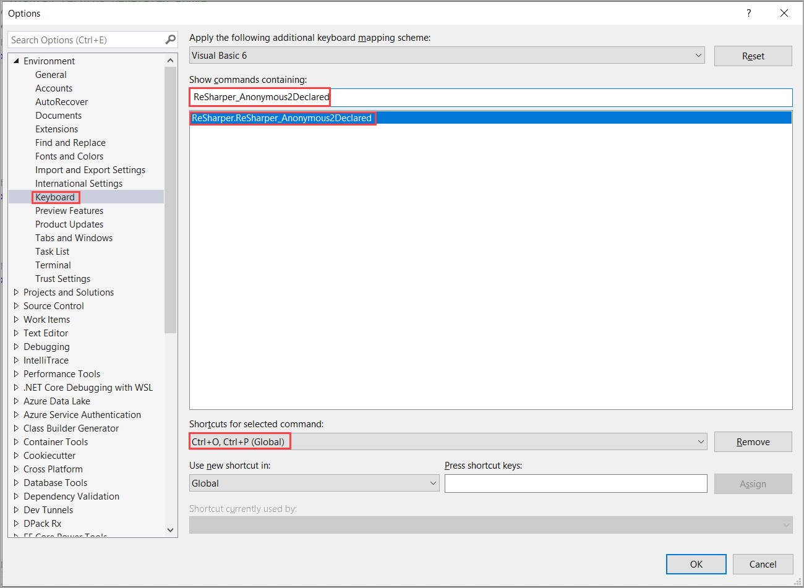
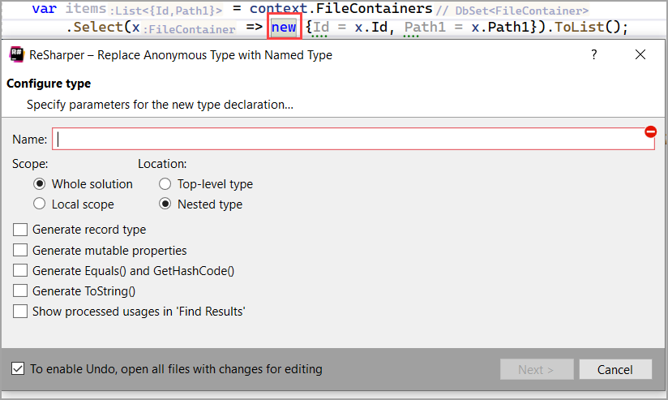
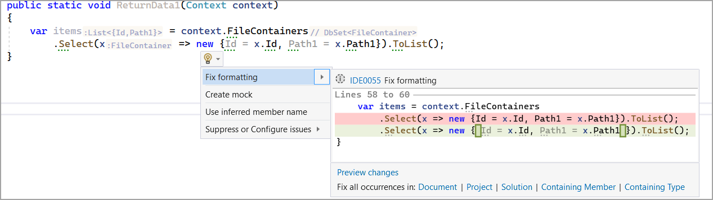
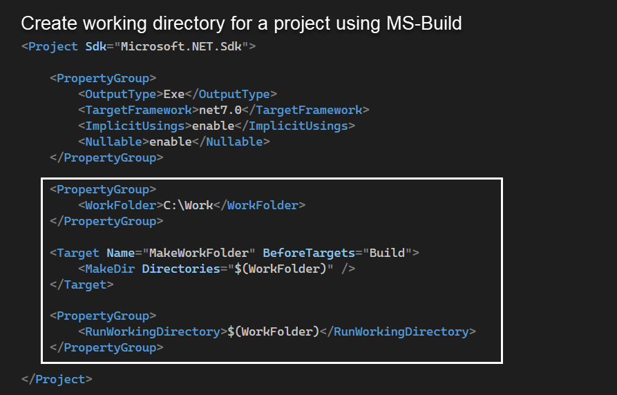

# Resharper - Convert Anonymous to Named Type refactoring

[Documentation](https://www.jetbrains.com/help/resharper/Refactorings__Convert_Anonymous_to_Named_Type.html)

Karen's shortcut <kbd>ctrl</kbd> + <kbd>O</kbd> <kbd>P</kbd>

Anonymous types are very convenient when you need to process a result of a query locally. However, if you need to pass the result around your program or if there are several queries that return the similar name/value parts, you may probably need a named type.

In such cases, ReSharper can convert the existing usage (or usages) of an anonymous type into a named type and update the usages. If necessary, ReSharper will find and convert similar anonymous types in the whole solution. In the dialog that this refactoring provides, you can customize the created type — specify whether it should have auto-properties or properties with backing fields, or generate equality and formatting method overrides.

## Example


Given the following, the model `FileContainer` has a primary key and three string properties. We want the key and one string property.

```csharp
public static void ReturnData1(Context context)
{
    var items = context.FileContainers
        .Select(x => new {Id = x.Id, Path1 = x.Path1}).ToList();
}
```

Using Resharper we can convert to using a keyboard shortcut.

```csharp
public static List<FileContainerSmall> ReturnData2(Context context) 
    => context.FileContainers
        .Select(x => new FileContainerSmall(x.Id, x.Path1)).ToList();
```

## Defining a shortcut



## Using the new shortcut

- In `ReturnData1`, place the cursor on `new`, press the shortcut and get a dialog as per below.
- Provide a nae and set options as needed.
- Once done you can move the new class to, in this case to the `Models` folder.




# Inferrred member name

Given 

```csharp
public static void ReturnData1(Context context)
{
    var items = context.FileContainers
        .Select(x => new {Id = x.Id, Path1 = x.Path1}).ToList();
}
```

We don't need to specify `Id` and `Path1`, ReSharper will offer to fix if so desired. 

:bulb: ReShaper recommendations are not always going to be correct so don't depend on ReShaper recommendations.



# How to set application working folder in project file

Many applications use their executable folder for creating and accessing various forms of files while an alternative is to use a folder devoid of the folder where the executable resides or any sub folder, this project show how to create a working folder using MS-Build task.

- First decide on the folder to perform work e.g. read/write to files or open a database
- Next create a variable in a `PropertyGroup` as shown below `WorkingFolder` as we need it in to places
- Create a `Target` for creating the folder indicated above before the build process takes place which uses [MakeDir](https://learn.microsoft.com/en-us/visualstudio/msbuild/makedir-task?view=vs-2022) task to create the folder
- Create a `PropertyGroup` to set the working forlder using [RunWorkingDirectory](https://learn.microsoft.com/en-us/dotnet/core/project-sdk/msbuild-props#runworkingdirectory). The RunWorkingDirectory property defines the working directory for the application process to be started in. It can be an absolute path or a path that's relative to the project directory. If you don't specify a directory, OutDir is used as the working directory.


> **Note**
> Any time something is needed more than once always create a variable as done in the second bullet above as there is always the chance of a misspelling which leads to undesirable results.


## Examples


:small_orange_diamond: Create a SqlLite database in the working folder, populate and view via EF Core.

