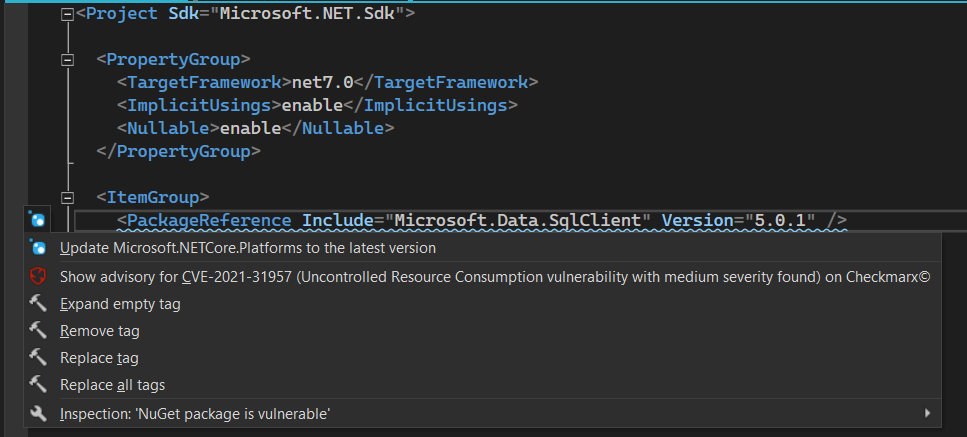

# Security

Whenever you’re using open-source NuGet packages in your solutions, there's a risk of opening your project up to security vulnerabilities. While there are outside tools NuGet provides to screen for such threats, it's infinitely more convenient to have a tool like that right in your IDE to catch any vulnerabilities during design time. That's why we're introducing vulnerable dependency detection in ReSharper. Starting with this release, any affected dependencies will be highlighted in `.csproj` and `.vbproj` files.

