# ReSharper

ReSharper `R#` is a Visual Studio extension which can assist with

- Learning what you don't know but should know
- An extensive list of code [refactors](https://www.jetbrains.com/resharper/features/code_refactoring.html)
- Coding [assistance](https://www.jetbrains.com/resharper/features/coding_assistance.html)
- Quick fixes to eliminate errors and bad code
- Code [completion](https://www.jetbrains.com/resharper/features/code_completion.html)
- Continuous [code quality analysis](https://www.jetbrains.com/resharper/features/code_analysis.html)
- Better [unit testing](https://www.jetbrains.com/resharper/features/unit_testing.html)
- ASP.NET, ASP.NET MVC, and ASP.NET Core [tools](https://www.jetbrains.com/resharper/features/asp_net_editor.html)
- JavaScript and TypeScript [tools](https://www.jetbrains.com/resharper/features/javascript_typescript.html)
- Debugging [assistance](https://www.jetbrains.com/resharper/features/debugging_assistance.html)
- Code [templates](https://www.jetbrains.com/resharper/features/code_templates.html)
- Keyboard: There are various considerations, see [the following docs](https://www.jetbrains.com/help/resharper/Configuring_Keyboard_Shortcuts.html)
    - Default keyboard shortcut [schemes](https://www.jetbrains.com/help/resharper/Reference__Keyboard_Shortcuts.html)


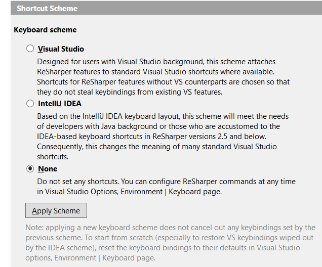

</br>

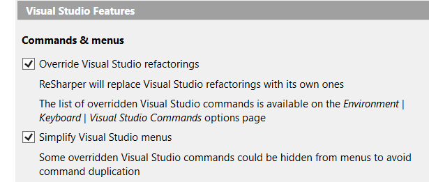


> **Note**
> One issue with R# is that if someone does not explain what is possible or a developer does not explore the documentation R# does not seem worthwhile which is what we are going to explore, many common features. It is impossible to go over every single feature as there are way too many.

</br>

:bulb: `R#` settings and templates can easily be exported to other developers see [settings](https://www.jetbrains.com/help/resharper/Sharing_Configuration_Options.html#managing) and [export](https://www.jetbrains.com/help/resharper/Templates__Managing_Templates__Importing_and_Exporting_Templates.html) templates.

# PostFix

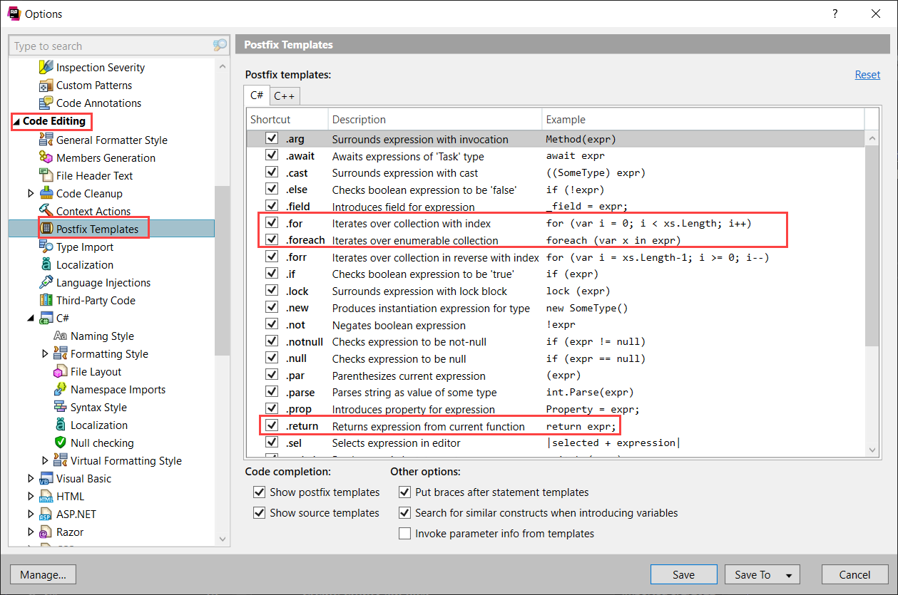

# Templates

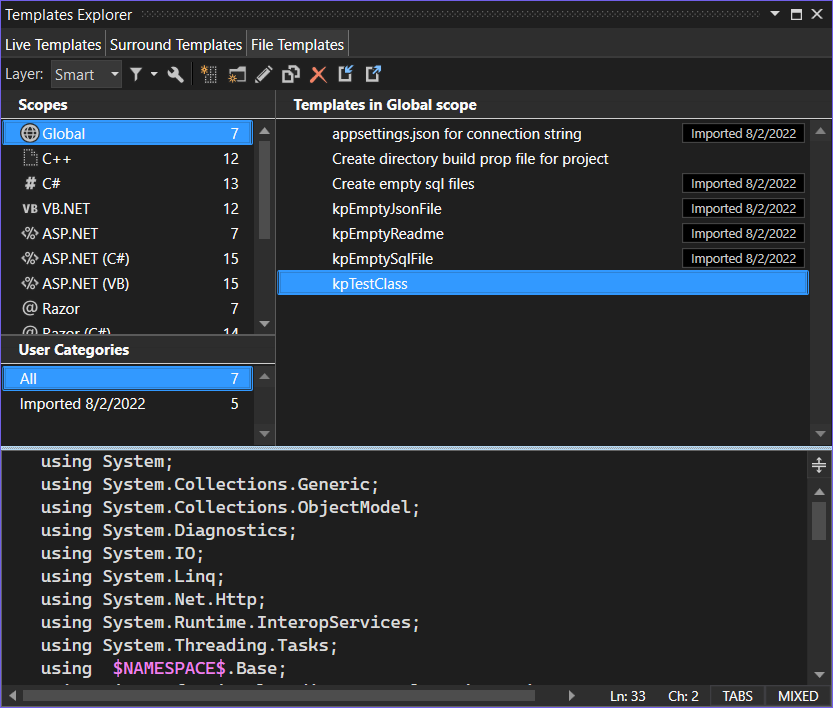

# Navigate To: Decompiled Sources

Find under options, environment, keyboard **ReSharper_NavigateToDecompiledSources**. By default R# will ask what behavior you want.

This command allows you to navigate to declarations of library types and methods reconstructed by decompilation. Decompiled source code is shown in the editor as a reconstructed source file, in read-only mode. All relevant ReSharper's navigation and search commands are available in the decompiled view.

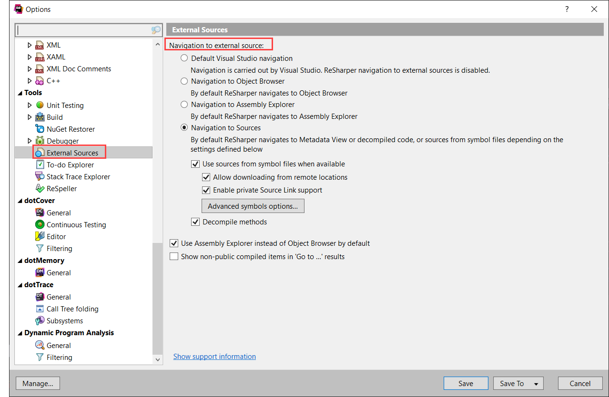

## Troubleshooting

If you are new to ReSharper or something goes wrong during your everyday work, there are several places where you can search for a solution, ask for advice, submit bugs, suggest new features or just talk to people that share the same interests.

See also [docs](https://www.jetbrains.com/help/resharper/Introduction__Troubleshooting.html)

# TODO Explorer

<kbd>ctrl</kbd> + <kbd>alt</kbd> + <kbd>D</kbd>

`ReSharper_ShowTodoExplorer`

- R# provides an easy way to track tasks and technical debt in your code,  code items (comments, string literals, or identifiers) matching a specific pattern can be easily located in the editor as well as in the whole solution using the To-do Explorer window.
- To navigate from code to the task window see second image below


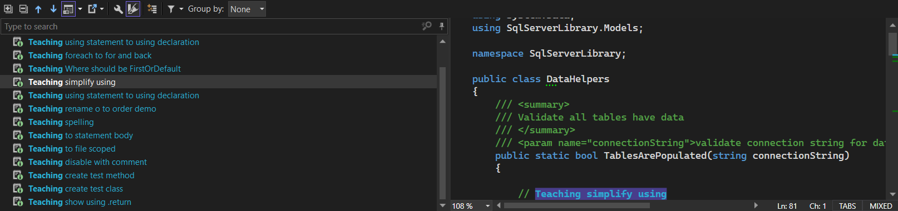

<br>

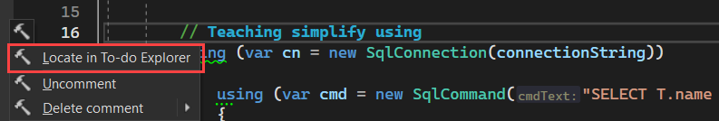

---

# Non-Resharper

##  .NET and .NET Core Support Policy

https://dotnet.microsoft.com/en-us/platform/support/policy/dotnet-core

Although `.NET 7` is short term support I recommend this over `.NET 6` only if there is a plan to move to .NET 8 November 2023 otherwise go with `.NET 6`.


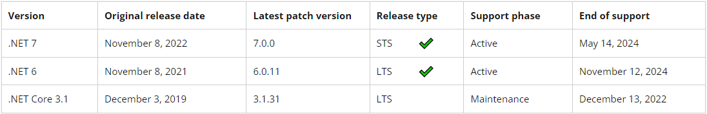


# File structure

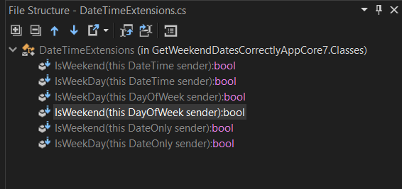

# C# some new features

New features are mixed into ReSharper samples which Karen will discuss.

## File scoped namespaces

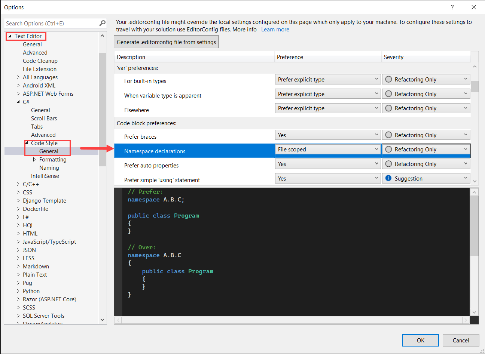

## Using Directory.Build.props for versioning

To set an appliction's version for .NET Framework 4.8 and earlier, this is done under project properties as per below.

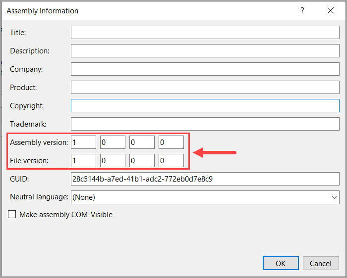

For .NET Framework Core this can be done under Properties, Package, General. Another option is to create `Directory.Build.props` as per below.

```xml
<Project>
    <PropertyGroup>
        <Version>1.1</Version>
        <FileVersion>1.0.0.0</FileVersion>
    </PropertyGroup>
</Project>
```

## MS-Build

Some ideas in the following [repository](https://github.com/karenpayneoregon/ms-build-examples)


