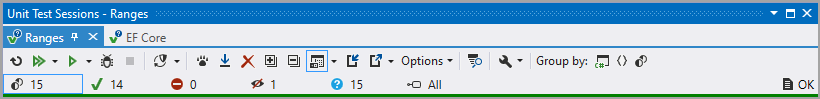
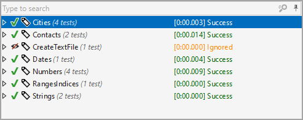

# Unit testing with ReSharper

The two unit test project were picked randomly to show sessions.

Unit test can be setup in `sessions` by project or other criteria



</br>

Group by trait

```csharp
public enum Trait
{
    PlaceHolder,
    RangesIndices,
    CreateTextFile,
    Contacts,
    Cities,
    Strings,
    Dates,
    Numbers
}
```


